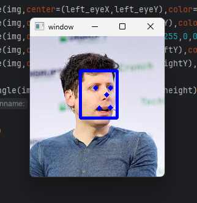

# Face Detection with MTCNN and OpenCV

This project demonstrates face detection and facial keypoint localization using the [MTCNN](https://pypi.org/project/mtcnn/) library together with [OpenCV](https://opencv.org/).

It includes two main scripts:
1. **Image Detection** – detects faces and facial landmarks in a static image.  
2. **Webcam Detection** – performs live face detection using your computer’s webcam.

---

## Features
- Detects multiple faces in static images and live video.
- Identifies and marks key facial points in images:
  - Left eye
  - Right eye
  - Nose
  - Mouth (left and right corners)
- Draws bounding boxes around detected faces.
- Real-time detection from webcam feed.

---

## Requirements

Install Python dependencies:

```bash
pip install mtcnn opencv-python
```

## Example Output

